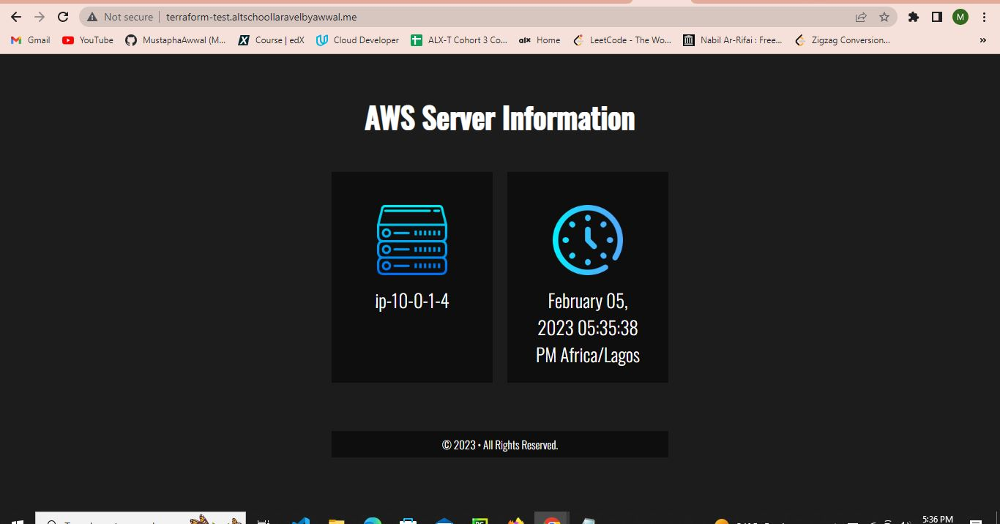
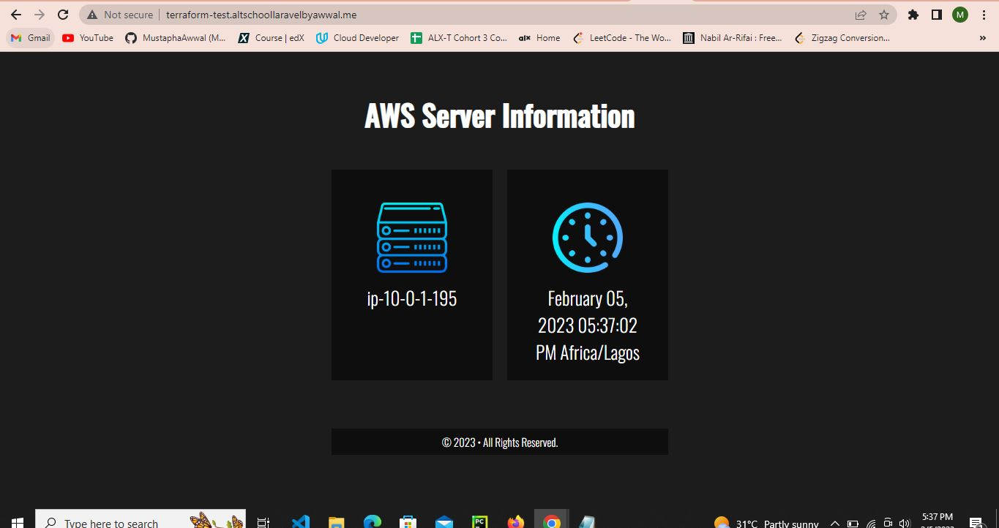
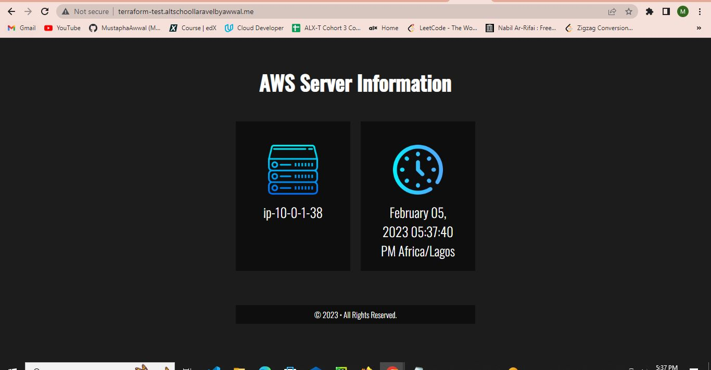

# TerraformProject

This project demonstrates the use of Terraform to automate the provisioning of infrastructure on AWS and Ansible for configuration management. The goal is to create 3 EC2 instances behind an Elastic Load Balancer, configure DNS using Route53, and deploy a simple Apache web server.

## Prerequisites

Before getting started, make sure you have the following prerequisites installed:

- Terraform
- Ansible

## Usage

1. Clone the repository:

`git clone https://github.com/MustaphaAwwal/TerraformProject.git`

2. Change into the project directory:

`cd TerraformProject`

3. Initialize Terraform:

`terraform init`

4. Create the infrastructure:

`terraform apply`

This command will provision 3 EC2 instances and an Elastic Load Balancer on AWS. It will also create a record in Route53 and associate the load balancer's DNS with a subdomain.

5. Run the Ansible script:

`ansible-playbook main.yml`

This command will use the host-inventory file generated by Terraform to configure the EC2 instances. It installs Apache, sets the timezone to Africa/Lagos, and deploys a simple HTML page to each instance.

6. Access the website:

Visit `terraform-test.yourdomain.com` in your web browser. The page should display the content from the EC2 instances, rotating between them on each refresh.

## Clean Up

To clean up and destroy the created resources, run:

Please note that this will permanently delete all the provisioned infrastructure, including the EC2 instances, Load Balancer, and DNS records.

## Screenshots

